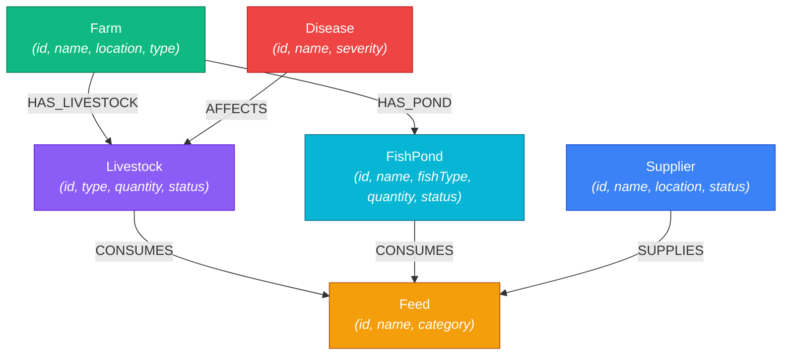

# AgroLink — Farm Dependency & Relationship Intelligence Platform

> **AgroLink** is a graph-first relationship intelligence web application built for the **WEXA AI Candidate Take-Home Assignment**. It enables agricultural managers, supply chain auditors, and biosecurity officers to trace supply chains, model operational blast radiuses, and detect disease exposure risks across interconnected farm networks.

---

## 1. Why a Graph Database?

Traditional relational databases (RDBMS) model data in tabular schemas. When analyzing complex supply chain dependencies or epidemic disease vectors, answer queries require traversing many-to-many relationships across multiple entity boundaries (e.g. `Farm` → `Livestock` → `Feed` → `Supplier`).

### The Relational (SQL) Problem
In an RDBMS, answering **"Which farms share a feed supplier with Farm Alpha?"** requires:
1. Joining 5+ tables: `farms`, `farm_livestock`, `livestock`, `livestock_feed`, `feed`, `feed_suppliers`, `suppliers`.
2. Performing multiple self-joins across junction tables.
3. Executing expensive `GROUP BY` and `DISTINCT` aggregations.
4. Handling variable-length paths (e.g., entity connections 1 to 4 hops away) requires complex `WITH RECURSIVE` Common Table Expressions (CTEs) that suffer from combinatorial join explosions and poor query performance.

### The Graph (Cypher) Solution
With **CognoDB / Neo4j** and **openCypher**, relationships are first-class entities stored as direct pointers between nodes. 

* **Index-Free Adjacency**: Traversing a relationship is an $O(1)$ memory pointer dereference, independent of total database size.
* **Declarative Path Traversals**: Complex 3-hop or variable-depth paths are expressed concisely:
  ```cypher
  // Multi-hop path traversal in 1 line
  MATCH (s:Supplier {id: $supplierId})-[:SUPPLIES]->(:Feed)<-[:CONSUMES]-(:Livestock)<-[:HAS_LIVESTOCK]-(f:Farm)
  RETURN f
  ```
* **Real-time Impact Analysis**: Operational blast radius calculations evaluate connected downstream risks instantaneously.

---

## 2. Graph Data Model

AgroLink represents agricultural ecosystems using **6 node labels** and **5 typed relationship categories**:



### Seed Data Metrics
The repository includes a repeatable seed script (`seed/seed.cypher`) that creates exactly:
* **20 Nodes**:
  * 3 Farms (`Farm Alpha`, `Farm Beta`, `Farm Delta`)
  * 5 Livestock batches (`L001` - `L005`)
  * 2 FishPonds (`P001`, `P002`)
  * 4 Feeds (`Layer Pro`, `Broiler Max`, `Fish Grower`, `Aqua Premium`)
  * 3 Suppliers (`GreenFeed`, `AquaFeeds`, `Prime Agro Supplies`)
  * 3 Diseases (`Newcastle Disease`, `Avian Influenza`, `Fowl Pox`)
* **27 Typed Relationships**:
  * 5 `HAS_LIVESTOCK`
  * 2 `HAS_POND`
  * 8 `CONSUMES`
  * 6 `SUPPLIES`
  * 6 `AFFECTS`

---

## 3. Engineering Architecture

```text
┌─────────────────────────────────────────────────────────────┐
│                    React 19 Frontend                        │
│          (Vanilla CSS Dark Theme, Path Visualization)       │
└──────────────────────────────┬──────────────────────────────┘
                               │ HTTP / JSON API (Proxy :5173 -> :8080)
┌──────────────────────────────▼──────────────────────────────┐
│                   Spring Boot 3 Backend                     │
│  ┌───────────────────────────────────────────────────────┐  │
│  │ REST Controllers (Health, Entity, Explore)             │  │
│  └───────────────────────────┬───────────────────────────┘  │
│  ┌───────────────────────────▼───────────────────────────┐  │
│  │ GraphService (Domain Logic & Validation)              │  │
│  └───────────────────────────┬───────────────────────────┘  │
│  ┌───────────────────────────▼───────────────────────────┐  │
│  │ GraphRepository (Parameterized Cypher & Exceptions)   │  │
│  └───────────────────────────┬───────────────────────────┘  │
└──────────────────────────────┼──────────────────────────────┘
                               │ Bolt Protocol (openCypher)
┌──────────────────────────────▼──────────────────────────────┐
│                    CognoDB / Neo4j Graph                    │
│             (Remote Graph Database Cluster)                 │
└─────────────────────────────────────────────────────────────┘
```

### Layer Responsibilities
1. **Controllers** (`EntityController`, `ExploreController`, `HealthController`): Handle HTTP request routing, query parameters, and JSON response mapping.
2. **Service Layer** (`GraphService`): Enforces domain invariants (e.g. hop counts between 1 and 4), parses `EntityType` paths, and aggregates multi-path impact calculations.
3. **Repository Layer** (`GraphRepository`): Executes parameterized Cypher queries against the `SessionConfig.forDatabase()`, converting Neo4j `Record` objects to immutable Java records.
4. **Driver Configuration** (`Neo4jConfig`): Manages a singleton `org.neo4j.driver.Driver` instance for connection pooling.

---

## 4. Main Cypher Queries Explained

### 1. Direct Connections (1-Hop Lookup)
* **Goal**: Retrieve immediate outgoing and incoming neighbors for any graph node.
* **Cypher Query**:
  ```cypher
  MATCH (n:Supplier {id: $id})-[r]-(m)
  RETURN DISTINCT m.id AS id, labels(m)[0] AS type, m.name AS name, type(r) AS relationship
  ```

### 2. Supplier Dependency Traversal (3-Hop Multi-Hop)
* **Goal**: Identify all farms dependent on a specific supplier through feed products consumed by their livestock.
* **Cypher Query**:
  ```cypher
  MATCH (s:Supplier {id: $supplierId})-[:SUPPLIES]->(feed:Feed)<-[:CONSUMES]-(livestock:Livestock)<-[:HAS_LIVESTOCK]-(farm:Farm)
  WITH s, farm, collect(DISTINCT feed.name) AS feedNames
  RETURN farm.id AS id, farm.name AS name, feedNames
  ```

### 3. Disease to Supplier Traversal (3-Hop Risk Vector)
* **Goal**: Find feed suppliers connected to livestock batches currently exposed to infectious diseases.
* **Cypher Query**:
  ```cypher
  MATCH (d:Disease {id: $diseaseId})-[:AFFECTS]->(livestock:Livestock)-[:CONSUMES]->(feed:Feed)<-[:SUPPLIES]-(supplier:Supplier)
  RETURN DISTINCT supplier.id AS id, supplier.name AS name
  ```

### 4. Shared Suppliers Traversal (6-Hop Cross-Farm Risk)
* **Goal**: Find farms that share a feed supplier with a target farm.
* **Cypher Query**:
  ```cypher
  MATCH (farm:Farm {id: $farmId})-[:HAS_LIVESTOCK|HAS_POND]->()-[:CONSUMES]->(feed:Feed)<-[:SUPPLIES]-(supplier:Supplier)
  MATCH (supplier)-[:SUPPLIES]->(peerFeed:Feed)<-[:CONSUMES]-()<-[:HAS_LIVESTOCK|HAS_POND]-(peerFarm:Farm)
  WHERE peerFarm.id <> farm.id
  RETURN DISTINCT peerFarm.id AS id, peerFarm.name AS name
  ```

### 5. Farm Ecosystem Traversal (Relationally Awkward Variable-Length Path Query)
* **Goal**: Explore all entities connected to a farm within $N$ hops ($1 \le N \le 4$).
* **Why Relationally Awkward?**: In SQL, querying variable-length paths of unknown depth requires recursive CTEs and multiple outer joins across 5 junction tables. In Cypher, it is a single declarative expression:
* **Cypher Query**:
  ```cypher
  MATCH p=(farm:Farm {id: $farmId})-[*1..4]-(other)
  WHERE other.id IS NOT NULL AND other.id <> farm.id AND length(p) <= $hops
  RETURN DISTINCT other.id AS id, labels(other)[0] AS type, p AS path
  ```

### 6. Supplier Impact Blast Radius Analysis
* **Goal**: Map the total operational risk radius of a supplier outage across feeds, livestock, fish ponds, and farms.
* **Cypher Queries**: Combines multi-path traversals (`Supplier` → `Feed` → `Livestock`/`FishPond` → `Farm`) to compute affected assets and merged impact reasons.

---

## 5. Environment & Security Configuration

### Security Rules
* **No Hardcoded Secrets**: No database passwords or private credentials are stored in git-tracked source code or `application.yml`.
* **Zero-Dependency Local `.env` Loader**: `AgroLinkApplication.java` automatically loads local `backend/.env` key-value pairs into Java system properties at startup if present.

### Required Environment Variables

| Variable | Description | Example |
| :--- | :--- | :--- |
| `COGNODB_URI` | Bolt connection URI for CognoDB/Neo4j | `bolt+s://db-c4e67a97.bravo.databases.cognodb.com` |
| `COGNODB_USERNAME` | Database username | `cognodb` |
| `COGNODB_PASSWORD` | Database user password | *Provided securely via environment / secrets* |
| `COGNODB_DATABASE` | Database name | `neo4j` |
| `PORT` | Spring Boot HTTP server port | `8080` |

---

## 6. Setup & Execution Instructions

### Prerequisites
* Java 17 (Temurin / OpenJDK)
* Maven 3.8+
* Node.js 18+ & npm

### 1. Configure Local Environment
Create `backend/.env` (ignored by Git):
```bash
cp backend/.env.example backend/.env
```
Populate `backend/.env` with your CognoDB credentials.

### 2. Seed and Verify the Database
To run the Cypher seed script and verify node/relationship counts:
```bash
# Seed 20 nodes and 27 relationships
COGNODB_PASSWORD="your_password" mvn test -Dtest=SeedRunner
```

### 3. Start Backend Server
```bash
cd backend
mvn spring-boot:run
```
The Spring Boot backend will start on `http://localhost:8080`.

### 4. Start Frontend Client
```bash
cd frontend
npm install
npm run dev
```
The React frontend will start on `http://localhost:5173`.

---

## 7. API Endpoint Verification

You can verify the backend endpoints using `curl`:

```bash
# Database Health Check
curl -s http://localhost:8080/api/health

# List all Entities
curl -s http://localhost:8080/api/entities

# Direct Connections for Supplier S001
curl -s http://localhost:8080/api/entities/Supplier/S001

# Supplier Dependency Traversal
curl -s http://localhost:8080/api/explore/supplier/S001/farms

# Disease to Supplier Exposure
curl -s http://localhost:8080/api/explore/disease/D001/suppliers

# Shared Suppliers for Farm F001
curl -s http://localhost:8080/api/explore/farm/F001/shared-suppliers

# 3-Hop Farm Ecosystem Traversal
curl -s "http://localhost:8080/api/explore/farm/F001/ecosystem?hops=3"

# Supplier Impact Blast Radius Analysis
curl -s http://localhost:8080/api/explore/supplier/S001/impact
```

---

## 8. Screen Recording Demonstration Script

1. **Introduction**: Display the AgroLink landing page at `http://localhost:5173`.
2. **Health Indicator**: Highlight the top-right green database health badge showing `"Connected to CognoDB"`.
3. **Entity Selection**: Select `Supplier` from the catalog and pick `GreenFeed (S001)`.
4. **Direct Connections**: Click **Direct Connections** to view linked feeds (`Layer Pro`, `Broiler Max`).
5. **Supplier Dependency**: Run **Supplier Dependency** to display downstream farms (`Farm Alpha`, `Farm Beta`, `Farm Delta`).
6. **Supplier Impact Analysis**: Run **Supplier Impact Analysis** to display the complete blast radius across feeds, livestock, ponds, and farms.
7. **Disease Vector**: Select `Disease` → `Newcastle Disease (D001)` and run **Disease to Supplier** to show affected feed suppliers.
8. **Ecosystem Traversal**: Select `Farm` → `Farm Alpha (F001)` and run **Farm Ecosystem (3 hops)** to demonstrate variable-length path visualization rails.

---

## 9. Deliverables & Repository Info

* **GitHub Repository**: [https://github.com/leekhato-blip/agrolink](https://github.com/leekhato-blip/agrolink)
* **Latest Commit SHA**: `be8fc3f`
* **License**: MIT
